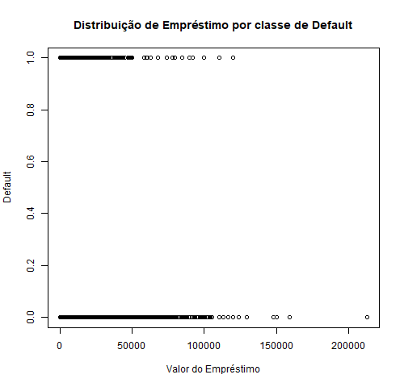
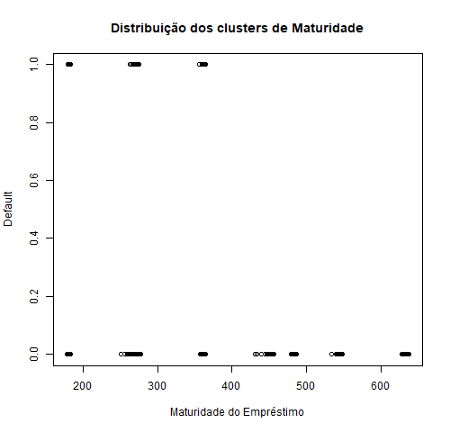

```{r setup, include=FALSE}
knitr::opts_chunk$set(echo = TRUE)
```

# Manipulação de Dados e Data Wrangling

```{r eval  = TRUE, echo = FALSE, warning = FALSE, include=FALSE}

#Background setting

setwd('..')

#Loading Library Functions

source("./library/functions.R")

#Installing and loading necessary packages

packages = c("tidyverse", "rmarkdown", "arrow","data.table", "caret", "corrplot","xgboost", "cowplot",
             "lubridate", "gmodels","rlist","ROCR", "rpart","rpart.plot","rattle","RColorBrewer","Hmisc", "partykit", 
             "randomForest", "caTools")

package_check(packages)

```

## 1 - Sumário do Dataset de Treino 
```{r eval  = TRUE, echo = FALSE, warning = FALSE}

################################################################################################################################
####################################################### TRAIN PARQUET ###########################################################
################################################################################################################################

setwd('..') 

#Loading Database

train.parquet <- read_parquet("./database/train.parquet", as_tibble = TRUE)

```


```{r}

#Dimensão do Dataset de Treino
dim(train.parquet)

#Avaliando a estrutura de dados do dataset
str(train.parquet)

#Descrição do Dataset
describe(train.parquet)

```


É possível observar que o dataset de treino (`train.parquet`), a variável  `subsegmento` possui missing values, `NA`.

Nestes casos, iremos classificá-los como `Sem Classificação`.

Além disso, iremos formartar as variáveis de `Date` (`as.Date`) e a variável `y`, a qual apresenta quais ID's quitaram antes do vencimento `0` ou não `1` como `Factor`  (`as.factor`).

## 2 - Limpeza e Formatação do Train DB (train.parquet)
```{r eval = TRUE, echo = FALSE, warning = FALSE}

#Eliminando valores NA
train.parquet <- train.parquet %>% replace_na(list(subsegmento = "Sem Classificação"))

#Formatando as variáveis do tipo DATE
train.parquet <- train.parquet %>% 
    mutate(desembolso = as.Date(desembolso, format = "%Y-%m-%d")) %>%
    mutate(vencimento = as.Date(vencimento, format = "%Y-%m-%d")) %>%
    mutate(dia = as.Date(dia, format = "%Y-%m-%d"))

#Formatando a variável do tipo FACTOR
train.parquet$y <- as.factor(train.parquet$y)

```

Como temos interesse em predizer no dia 90 do contrato de crédito a probabilidade do cliente não quitar a dívida até o vencimento.
Devemos filtrar `train.parquet` de forma a selecionar somente os 90 primeiros dias de contrato `train_90`.

````{r eval = TRUE, echo = FALSE}

#Temporary Database

temp <- train.parquet %>%
    group_by(id) %>%
    group_split()


#Taking the first 90 days of all id's (even if they finished to pay before)

train_90 <-train.parquet %>%
    group_by(id) %>%
    filter(dias_pos_desembolso <=90)


````

```{r eval = TRUE, echo = TRUE}

dim(train_90)

```

## 3 - Análise Exploratória de Dados - Inicial

### 3.1 - Análise Univariada

#### 3.1.1 - Variáveis Qualitativas

##### A - SUBSEGMENTO

Como apresentado pelo número de subsegmentos e confirmado pelo gráfico abaixo:

* Há muitos subsegmentos, então é provável que eles não influenciem a quitação do crédito dentro do prazo ou não.

```{r eval = TRUE, echo = FALSE}

t <- as.data.frame(table(train_90$subsegmento))

data <- t[t$Freq %in% tail(sort(t$Freq),5),]

data$Var1 <- as.character(data$Var1)
data <- rbind(data, data.frame(Freq = sum(t$Freq) - sum(data$Freq),Var1="others"))

```

```{r eval = TRUE, echo = TRUE}

#Quantos subsegmentos temos em nosso train dataset?
length(unique(train.parquet$subsegmento))

```

```{r eval = TRUE, echo = FALSE}

pie(data$Freq, data$Var1)

```

##### B - DEFAULT

A distribuição dos dados de default se apresentam da seguinte maneira (variável `y`): 

* Somente 4.4% do train dataset não quitou a dívida dentro do prazo estabelecido

```{r eval = TRUE, echo = FALSE}

#Criando uma database com todos os ID's aparecendo somente uma única vez
t2 <- train_90%>%
    distinct(y, .keep_all = TRUE) %>%
    mutate(maturidade = vencimento - desembolso)

#Sumarizando a distribuição
barplot(prop.table(table(t2$y)))

```

```{r eval = TRUE, echo = FALSE}
#Sumarizando a distribuição entre 
prop.table(table(t2$y))

```

#### 3.1.1 - Variáveis Quantitativas

É possível observar dos gráficos a seguir que:
    
* A maior parte dos empréstimos se concentram no intervalo de valores até 20k e, por consequência;
    
* A maior parte dos pagamentos diários estão distribuídos em *"parcelas diárias"* de até 100 reais/dia

``` {r eval = TRUE, echo = FALSE}

#Distribuição de valor_emprestado
hist((t2%>%filter(valor_emprestado < 50000))$valor_emprestado, xlab = "Valor do Empréstimo" ,main = "Distribuição dos Empréstimos Realizados - Até 50k")

```

``` {r eval = TRUE, echo = FALSE}

#Distribuição de pagamento_diario_esperado
hist(t2$pgto_diario_esperado, xlab = "Valor do Pagamento Diário Esperado" ,main = "Distribuição dos Pagamentos Diários Esperados")

```

### 3.2 - Análise Bivariada

#### 3.2.1 - Variáveis Qualitativas & Quantitativas

##### A  - DEFAULT & VALOR DO EMPRÉSTIMO

Pelo gráfico a seguir, é possível verificar que o valor do empréstimo dos que **não** quitaram a dívida é **menor** do que o valor do empréstimo para aqueles que quitaram dentro do prazo.

Porém, tal informação não parece ser significativa, pois há interseccção entre os grupos `0` e `1`, e provavelmente tal variável não será relevante para determinar se um ID irá ou não quitar a dívida no prazo. 



##### B  - DEFAULT & MATURIDADE

*Observação: `maturidade` é uma variável que indica quantos dias foram dados para o indivíduo quitar sua dívida, i.e. `maturidade = vencimento - desembolso`* 

É possível observar que o há intersecção entre dados para maturidades inferiores a 400 dias. Porém, é possível notar **não** há nenhuma observação de default (i.e. `y = 1`) que para maturidades **superiores** a 400 dias, ou seja, a variável `maturidade` pode ser uma variável significativa para nosso modelo.



Portanto, a partir dessa análise inicial do dataset bruto, concluímos que será necessário calcularmos variáveis mais relevantes para construirmos um modelo mais robusto de predição de default.

É disso que tratamos na seção a seguir. 

## 4 - Data Wrangling

Nesta seção iremos apresentar como foi feita a extração e manipulação de dados e quais são seus significados.

**1. Dados brutos extraídos:**

* `id`
* `valor_emprestado`
* `pgto_diário_esperado`
* `subsegmento`
* `y`
* `desembolso`
* `vencimento`
* `maturidade`: criado a partir de `desembolso` e `vencimento`

```{r eval= TRUE, echo = FALSE}

#Unindo dados brutos em uma única database

extract_raw <- train_90 %>% 
    select(id,valor_emprestado, pgto_diario_esperado, subsegmento, y, desembolso, vencimento) %>%
    mutate(maturidade = as.numeric(vencimento -  desembolso)) %>%
    select(-vencimento, -desembolso) %>%
    distinct(id, .keep_all = TRUE)

```

**2. Dados Manipulados:**

* `pgto_esperado_pp`: (*soma dos `pgto_diario_esperado` nos primeiros 90 dias* ) / (soma dos `pagamento_diario` nos primeiros 90 dias)
    
    * **Valores possíveis - Não Excluídos**: 
        
        * Entre `0` (para os que não realizaram nenhum pgto no período de 90 dias) e `1` (realizaram todos os pagamentos nos primeiros 90 dias)
            
    * **Valores possíveis - Excluídos**:
        
            * *< 0*: a observação negativa se deve ao fato de que nos primeiros 90 dias, o ID realizou outro empréstimo
    
* `juros_d`: calculados de acordo com a fórmula abaixo e factorizados em 6 classes (`juros_d_nivel`) 
$$
 juros = \frac{Divida.Total^t - Pagamento.Diario^{t+1}}{Divida.Total^{t+1}}
$$
        
    * `0 - 0.1`
    * `0.10 - 0.15`
    * `0.15 - 0.20`
    * `0.20 - 0.25`
    * `0.25 - 0.30`
    * `0.30+`
        
        * *Obs.: quando não foi possível calcular a taxa de juros , pois não havia mais do que 1 observação, o `juros_d` desse ID foi computado como 0 a fim de não perder informações sobre este tipo de observação*

* `taxa_t`: calculados de acordo com a fórmula abaixo e factorizados em 7 classes (incluindo `Missing Value` para situações onde nenhuma transação e/ou pagamento foram efetuados e para ID's com uma única observação).
$$
 juros = \frac{Pagamento.Diário^{t+1}}{Transacionado^{t}}
$$ 

    * `0 - 0.05`
    * `0.05 - 0.10`
    * `0.10 - 0.15`
    * `0.15 - 0.20`
    * `0.20 - 0.25`
    * `0.25+`
    * `Missing`
        
* `diasdepois_pgto`, `diasdepois_trans` e `diasdepois_amort`: mensura quantos dias após o desembolso (dentro de um período de 90 dias), os ID's performaram o 1º Pagamento, a 1ª Amortização e a 1ª Transação. Dados foram factorizados em 9 classes.
        
    * `0 - 2`
    * `3 - 5`
    * `6 - 8`
    * `9 - 12`
    * `13 - 15`
    * `16 - 20`
    * `21 - 40`
    * `41 - 90`
    * `Missed 90 days`
        
* `liq_25`, `liq_50`, `liq_75` e `liq_dia_90`: porcentagem da `dívida_total` liquidada ao final de Q1 (`liq_25`), de Q2 (`liq_50`), de Q3 (`liq_75`) e ao final de 90 dias (`liq_dia_90`)

    * **Valores possíveis - Não Excluídos**: 
            
        * *Número de Observações - [4:89]* : quartis calculados a partir do número de dias disponíveis
            
            * Exemplo: 10 dias observados - Q1 (dia 3), Q2 (dia 5), Q3 (dia 8) e por fim, dia 10.,
                
        * *Número de Observações - [3]* : `liq_25` e `liq_50` calculados a partir de 1ª e da 2ª observação, enquanto `liq_75` = ´liq_dia_90`
        
        * *Número de Observações - [1:2]* : `liq_25` = `liq_50` = `liq_75` = `liq_dia_90`

* `media_pgto_25`, `media_pgto_50`, `media_pgto_75`, `media_pgto_90dias`: média do `pagamento_diario` no quartil Q1, Q2, Q3 e do período de Q3 até 90 dias.
    
    * **Valores possíveis - Não Excluídos**:
        
        * ID's com observações inferiores a 90 dias: quartis calculados a partir do número de dias disponíveis
            
            * Exemplo: 10 dias observados - Q1 (dia 3), Q2 (dia 5), Q3 (dia 8) e por fim, dia 10.
    
* `freq_xx_pgto`, `freq_xx_amort` e `freq_xx_trans`: frequência do `pagamento_diario`, `amortizacao_principal_diario` e `transacionado` efetuados em Q1 (i.e. `freq_25_pgto`, `freq_25_amort` e `freq_25_trans`), Q2, Q3 e entre Q3-dias e 90 dias.
    * **Valores possíveis - Não Excluídos**:
        
        * ID's com observações inferiores a 90 dias: quartis calculados a partir do número de dias disponíveis
            
            * Exemplo: 10 dias observados - Q1 (dia 3), Q2 (dia 5), Q3 (dia 8) e por fim, dia 10.

```{r eval= TRUE, echo = FALSE, warning = FALSE, include=FALSE}

#Expected Payment vs Daily payment (pgto_esperado_pp)

pgto_esperado_90_total <- train_90  %>% 
    select(id,pgto_diario_esperado) %>% 
    group_by(id) %>% 
    summarise(pgto_esperado_90_total = sum(pgto_diario_esperado))

pgto_90_diario <- train_90  %>% 
    select(id, pagamento_diario) %>% 
    group_by(id) %>% 
    summarise(pgto_90_diario = sum(pagamento_diario))

pgto_pp <- pgto_esperado_90_total%>%
    left_join(pgto_90_diario, by = c("id" = "id"))%>%
    mutate(pgto_esperado_pp = pgto_90_diario / pgto_esperado_90_total)%>%
    mutate(pgto_esperado_pp = replace_na(pgto_esperado_pp, 0))%>%
    select(-pgto_esperado_90_total, - pgto_90_diario)

rm(pgto_90_diario, pgto_esperado_90_total)


#Daily Interest Rate (juros) and separating them into bins

juros_d <- juros(temp)

    ##Classes de Juros
    
    juros_d$juros_d_nivel <- rep(NA, length(juros_d$juros))
    
    juros_d$juros_d_nivel[which(juros_d$juros <= 0.0010)] <- "0 - 0.1"
    juros_d$juros_d_nivel[which(juros_d$juros > 0.0010 & juros_d$juros <= 0.0015)] <- "0.10 - 0.15"
    juros_d$juros_d_nivel[which(juros_d$juros > 0.0015 & juros_d$juros <= 0.0020)] <- "0.15 - 0.20"
    juros_d$juros_d_nivel[which(juros_d$juros > 0.0020 & juros_d$juros <= 0.0025)] <- "0.20 - 0.25"
    juros_d$juros_d_nivel[which(juros_d$juros > 0.0025 & juros_d$juros <= 0.0030)] <- "0.25 - 0.30"
    juros_d$juros_d_nivel[which(juros_d$juros > 0.0030)] <- "0.30+"
    
    juros_d$juros_d_nivel <- as.factor(juros_d$juros_d_nivel)
    juros_d$juros_d_nivel <- factor(juros_d$juros_d_nivel, ordered = TRUE)
    
    
    juros_d <- juros_d[,-c(2)]


#Rate over transactions (taxa_transacao)

temp1 <- train.parquet %>%
    #filter(id %in% id_indices)%>%
    select(id, dia, pagamento_diario, transacionado) %>%
    filter(pagamento_diario != 0 | transacionado != 0) %>%
    mutate(taxa_transacao = pagamento_diario / lag(transacionado)) %>%
    select(id, taxa_transacao) %>%
    filter( !is.na(taxa_transacao) & taxa_transacao != 0 & !is.infinite(taxa_transacao) & taxa_transacao < 1) %>%
    mutate(taxa_transacao = round(taxa_transacao,3))%>%
    group_by(id) %>%
    group_split()

taxa_t <- taxa(temp1)

#Including all id's
taxa_t <- juros_d%>%
    left_join(taxa_t, by = c("id" = "id"))%>%
    select(-juros_d_nivel)

#Classifying rate of transaction into levels

taxa_t$taxa_t_nivel <- rep(NA, length(taxa_t$taxa_transacao))

taxa_t$taxa_t_nivel[which(taxa_t$taxa_transacao <= 0.05)] <- "0 - 0.05"
taxa_t$taxa_t_nivel[which(taxa_t$taxa_transacao > 0.05 & taxa_t$taxa_transacao <= 0.10)] <- "0.05 - 0.10"
taxa_t$taxa_t_nivel[which(taxa_t$taxa_transacao > 0.10 & taxa_t$taxa_transacao <= 0.15)] <- "0.10 - 0.15"
taxa_t$taxa_t_nivel[which(taxa_t$taxa_transacao > 0.15 & taxa_t$taxa_transacao <= 0.20)] <- "0.15 - 0.20"
taxa_t$taxa_t_nivel[which(taxa_t$taxa_transacao > 0.20 & taxa_t$taxa_transacao <= 0.25)] <- "0.20 - 0.25"
taxa_t$taxa_t_nivel[which(taxa_t$taxa_transacao > 0.25)] <- "0.25+"
taxa_t$taxa_t_nivel[which(is.na(taxa_t$taxa_transacao))] <- "Missing"

taxa_t$taxa_t_nivel <- as.factor(taxa_t$taxa_t_nivel)
taxa_t$taxa_t_nivel <- factor(taxa_t$taxa_t_nivel, ordered = TRUE)

taxa_t <- taxa_t[,-c(2)]
rm(temp1)


#How many days after the loan, clients perform first Pagamento, Amortização and Transação -  (diasdepois_pgto, diasdepois_amort, diasdepois_trans)
#If no payment was identified in the first 90 days, all variables will be 0

##Pagamento_diario

diasdepois_pgto <- diasdepois(train_90,"p")

    #Classifying days into bins
    
    diasdepois_pgto$id <- as.numeric(diasdepois_pgto$id)
    
    diasdepois_pgto$diasdepois_pgto <- as.numeric(diasdepois_pgto$diasdepois_pgto)
    
    diasdepois_pgto$diasdepois_pgto_nivel <- rep(NA, length(diasdepois_pgto$diasdepois_pgto))
    
    diasdepois_pgto$diasdepois_pgto_nivel[which(diasdepois_pgto$diasdepois_pgto <= 2)] <- "0 - 2"
    diasdepois_pgto$diasdepois_pgto_nivel[which(diasdepois_pgto$diasdepois_pgto > 2 & diasdepois_pgto$diasdepois_pgto <= 5)] <- "3 - 5"
    diasdepois_pgto$diasdepois_pgto_nivel[which(diasdepois_pgto$diasdepois_pgto > 5 & diasdepois_pgto$diasdepois_pgto <= 8)] <- "6 - 8"
    diasdepois_pgto$diasdepois_pgto_nivel[which(diasdepois_pgto$diasdepois_pgto > 8 & diasdepois_pgto$diasdepois_pgto <= 12)] <- "9 - 12"
    diasdepois_pgto$diasdepois_pgto_nivel[which(diasdepois_pgto$diasdepois_pgto > 12 & diasdepois_pgto$diasdepois_pgto <= 15)] <- "13 - 15"
    diasdepois_pgto$diasdepois_pgto_nivel[which(diasdepois_pgto$diasdepois_pgto > 15 & diasdepois_pgto$diasdepois_pgto <= 20)] <- "16 - 20"
    diasdepois_pgto$diasdepois_pgto_nivel[which(diasdepois_pgto$diasdepois_pgto > 20 & diasdepois_pgto$diasdepois_pgto <= 40)] <- "21 - 40"
    diasdepois_pgto$diasdepois_pgto_nivel[which(diasdepois_pgto$diasdepois_pgto > 40)] <- "41 - 90"
    diasdepois_pgto$diasdepois_pgto_nivel[which(is.na(diasdepois_pgto$diasdepois_pgto))] <- "Missed 90 days"
    
    diasdepois_pgto$diasdepois_pgto_nivel <- as.factor(diasdepois_pgto$diasdepois_pgto_nivel)
    diasdepois_pgto$diasdepois_pgto_nivel <- factor(diasdepois_pgto$diasdepois_pgto_nivel, 
                                                    levels = c("0 - 2","3 - 5", "6 - 8","9 - 12", "13 - 15","16 - 20", "21 - 40",
                                                               "41 - 90","Missed 90 days" ))

    diasdepois_pgto <- diasdepois_pgto[,-c(2)]


##Amortização

diasdepois_amort <- diasdepois(train_90,"a")

#Classifying days into bins

diasdepois_amort$id <- as.numeric(diasdepois_amort$id)

diasdepois_amort$diasdepois_amort <- as.numeric(diasdepois_amort$diasdepois_amort)

diasdepois_amort$diasdepois_amort_nivel <- rep(NA, length(diasdepois_amort$diasdepois_amort))

diasdepois_amort$diasdepois_amort_nivel[which(diasdepois_amort$diasdepois_amort <= 2)] <- "0 - 2"
diasdepois_amort$diasdepois_amort_nivel[which(diasdepois_amort$diasdepois_amort > 2 & diasdepois_amort$diasdepois_amort <= 5)] <- "3 - 5"
diasdepois_amort$diasdepois_amort_nivel[which(diasdepois_amort$diasdepois_amort > 5 & diasdepois_amort$diasdepois_amort <= 8)] <- "6 - 8"
diasdepois_amort$diasdepois_amort_nivel[which(diasdepois_amort$diasdepois_amort > 8 & diasdepois_amort$diasdepois_amort <= 12)] <- "9 - 12"
diasdepois_amort$diasdepois_amort_nivel[which(diasdepois_amort$diasdepois_amort > 12 & diasdepois_amort$diasdepois_amort <= 15)] <- "13 - 15"
diasdepois_amort$diasdepois_amort_nivel[which(diasdepois_amort$diasdepois_amort > 15 & diasdepois_amort$diasdepois_amort <= 20)] <- "16 - 20"
diasdepois_amort$diasdepois_amort_nivel[which(diasdepois_amort$diasdepois_amort > 20 & diasdepois_amort$diasdepois_amort <= 40)] <- "21 - 40"
diasdepois_amort$diasdepois_amort_nivel[which(diasdepois_amort$diasdepois_amort > 40)] <- "41 - 90"
diasdepois_amort$diasdepois_amort_nivel[which(is.na(diasdepois_amort$diasdepois_amort))] <- "Missed 90 days"

diasdepois_amort$diasdepois_amort_nivel <- as.factor(diasdepois_amort$diasdepois_amort_nivel)
diasdepois_amort$diasdepois_amort_nivel <- factor(diasdepois_amort$diasdepois_amort_nivel, 
                                                  levels = c("0 - 2","3 - 5", "6 - 8","9 - 12", "13 - 15","16 - 20", "21 - 40",
                                                             "41 - 90","Missed 90 days" ))

diasdepois_amort <- diasdepois_amort[,-c(2)]

##Transacionado
diasdepois_trans <- diasdepois(train_90,"t")

#Classifying days into bins

diasdepois_trans$id <- as.numeric(diasdepois_trans$id)

diasdepois_trans$diasdepois_trans <- as.numeric(diasdepois_trans$diasdepois_trans)

diasdepois_trans$diasdepois_trans_nivel <- rep(NA, length(diasdepois_trans$diasdepois_trans))

diasdepois_trans$diasdepois_trans_nivel[which(diasdepois_trans$diasdepois_trans <= 2)] <- "0 - 2"
diasdepois_trans$diasdepois_trans_nivel[which(diasdepois_trans$diasdepois_trans > 2 & diasdepois_trans$diasdepois_trans <= 5)] <- "3 - 5"
diasdepois_trans$diasdepois_trans_nivel[which(diasdepois_trans$diasdepois_trans > 5 & diasdepois_trans$diasdepois_trans <= 8)] <- "6 - 8"
diasdepois_trans$diasdepois_trans_nivel[which(diasdepois_trans$diasdepois_trans > 8 & diasdepois_trans$diasdepois_trans <= 12)] <- "9 - 12"
diasdepois_trans$diasdepois_trans_nivel[which(diasdepois_trans$diasdepois_trans > 12 & diasdepois_trans$diasdepois_trans <= 15)] <- "13 - 15"
diasdepois_trans$diasdepois_trans_nivel[which(diasdepois_trans$diasdepois_trans > 15 & diasdepois_trans$diasdepois_trans <= 20)] <- "16 - 20"
diasdepois_trans$diasdepois_trans_nivel[which(diasdepois_trans$diasdepois_trans > 20 & diasdepois_trans$diasdepois_trans <= 40)] <- "21 - 40"
diasdepois_trans$diasdepois_trans_nivel[which(diasdepois_trans$diasdepois_trans > 40)] <- "41 - 90"
diasdepois_trans$diasdepois_trans_nivel[which(is.na(diasdepois_trans$diasdepois_trans))] <- "Missed 90 days"

diasdepois_trans$diasdepois_trans_nivel <- as.factor(diasdepois_trans$diasdepois_trans_nivel)
diasdepois_trans$diasdepois_trans_nivel <- factor(diasdepois_trans$diasdepois_trans_nivel, 
                                                  levels = c("0 - 2","3 - 5", "6 - 8","9 - 12", "13 - 15","16 - 20", "21 - 40",
                                                             "41 - 90","Missed 90 days" ))

diasdepois_trans <- diasdepois_trans[,-c(2)]


#How many days took them to liquidate their debt -  25%, 50%, 75% and 100% of 90 days 

liquidacao_db <- liquidacao(train_90)


#Mean of value paid in "Pagamento Diário" in the quantile 25, 50 and 75 of 90 days - % with respect to "Pagamento Esperado"

media_pgto_pp <- media_pgto(train_90)


#Mean Weekly Frequency of "Pagamento Diário", "Amortização" and "Transacionado" in the 25%, 50% and 75% quantile of "maturidade"
#(25_freq_pgto, 25_freq_amort, 25_freq_trans, 50_freq_pgto, 50_freq_amort, 50_freq_trans, 75_freq_pgto, 75_freq_amort, 75_freq_trans)

freq_tempo_quartil <- freq_quartil(train_90)


################################################### Setting Final Train database #############################################

#Joining all tables

train <- extract_raw %>% 
    left_join(pgto_pp, by = c("id" = "id"))%>%
    left_join(diasdepois_pgto, by = c("id" = "id")) %>%
    left_join(diasdepois_amort, by = c("id" = "id")) %>% 
    left_join(diasdepois_trans, by = c("id" = "id")) %>%
    left_join(juros_d, by = c("id" = "id"))%>%
    left_join(taxa_t, by = c("id" = "id"))%>%
    left_join(liquidacao_db, by = c("id" = "id"))%>%
    left_join(media_pgto_pp, by = c("id" = "id"))%>%
    left_join(freq_tempo_quartil, by = c("id" = "id"))

```

Ao final, o dataset final de treino é gerado contendo todas essas variáveis indicadas anteriormente e armazenadas em um dataset nomeado `train`

``` {r eval= TRUE, echo = FALSE}

head(train)

```


``` {r eval= TRUE, echo = FALSE, warning = FALSE, include=FALSE}

################################################################################################################################
####################################################### TEST PARQUET ###########################################################
################################################################################################################################

setwd('..')

#Loading Test Database

test <- read_parquet("./database/test.parquet", as_tibble = TRUE)

#Evaluating Database
str(test)

#Checking for missing values
colSums((is.na(test)))
test <- test %>% replace_na(list(subsegmento = "Sem Classificação"))

#Reshaping Date variables
test <- test %>% 
    mutate(desembolso = as.Date(desembolso, format = "%Y-%m-%d")) %>%
    mutate(vencimento = as.Date(vencimento, format = "%Y-%m-%d")) %>%
    mutate(dia = as.Date(dia, format = "%Y-%m-%d"))

###############################################Feature Construction##################################################

#Temporary Database

temp <- test %>%
    group_by(id) %>%
    group_split()

#Taking the first 90 days of all id's (even if they finished to pay before)

test_90 <-test %>%
    group_by(id) %>%
    filter(dias_pos_desembolso <=90)

#Loan amount (valor_emprestado), pagamento diário esperado (pgto_diario_esperado), subsegmento, maturity (maturidade)
extract_raw2 <- test_90 %>% 
    select(id,valor_emprestado, pgto_diario_esperado, subsegmento, desembolso, vencimento) %>%
    mutate(maturidade = as.numeric(vencimento - desembolso)) %>%
    select(-vencimento, -desembolso) %>%
    distinct(id, .keep_all = TRUE)

#Expected Payment vs Daily payment (pgto_90_pp)

pgto_esperado_90_total <- test_90  %>% 
    select(id,pgto_diario_esperado) %>% 
    group_by(id) %>% 
    summarise(pgto_esperado_90_total = sum(pgto_diario_esperado))

pgto_90_diario <- test_90  %>% 
    select(id, pagamento_diario) %>% 
    group_by(id) %>% 
    summarise(pgto_90_diario = sum(pagamento_diario))

pgto_pp_2 <- pgto_esperado_90_total%>%
    left_join(pgto_90_diario, by = c("id" = "id"))%>%
    mutate(pgto_esperado_pp = pgto_90_diario / pgto_esperado_90_total)%>%
    mutate(pgto_esperado_pp = replace_na(pgto_esperado_pp, 0))%>%
    select(-pgto_esperado_90_total, - pgto_90_diario)

rm(pgto_90_diario, pgto_esperado_90_total)


#Daily Interest Rate (juros) and separating them into bins

juros_d2 <- juros(temp)

###############################################################################

##Classes de Juros

juros_d2$juros_d_nivel <- rep(NA, length(juros_d2$juros))

juros_d2$juros_d_nivel[which(juros_d2$juros <= 0.0010)] <- "0 - 0.1"
juros_d2$juros_d_nivel[which(juros_d2$juros > 0.0010 & juros_d2$juros <= 0.0015)] <- "0.10 - 0.15"
juros_d2$juros_d_nivel[which(juros_d2$juros > 0.0015 & juros_d2$juros <= 0.0020)] <- "0.15 - 0.20"
juros_d2$juros_d_nivel[which(juros_d2$juros > 0.0020 & juros_d2$juros <= 0.0025)] <- "0.20 - 0.25"
juros_d2$juros_d_nivel[which(juros_d2$juros > 0.0025 & juros_d2$juros <= 0.0030)] <- "0.25 - 0.30"
juros_d2$juros_d_nivel[which(juros_d2$juros > 0.0030)] <- "0.30+"

juros_d2$juros_d_nivel <- as.factor(juros_d2$juros_d_nivel)
juros_d2$juros_d_nivel <- factor(juros_d2$juros_d_nivel, ordered = TRUE)

juros_d2 <- juros_d2[,-c(2)]


#Rate over transactions (taxa_transacao)

temp1 <- test %>%
    select(id, dia, pagamento_diario, transacionado) %>%
    filter(pagamento_diario != 0 | transacionado != 0) %>%
    mutate(taxa_transacao = pagamento_diario / lag(transacionado)) %>%
    select(id, taxa_transacao) %>%
    filter( !is.na(taxa_transacao) & taxa_transacao != 0 & !is.infinite(taxa_transacao) & taxa_transacao < 1) %>%
    mutate(taxa_transacao = round(taxa_transacao,3))%>%
    group_by(id) %>%
    group_split()

taxa_t2 <- taxa(temp1)

#Including all id's
taxa_t2 <- juros_d2 %>%
    left_join(taxa_t2, by = c("id" = "id"))%>%
    select(-juros_d_nivel)

#Classifying rate of transaction into levels

taxa_t2$taxa_t_nivel <- rep(NA, length(taxa_t2$taxa_transacao))

taxa_t2$taxa_t_nivel[which(taxa_t2$taxa_transacao <= 0.05)] <- "0 - 0.05"
taxa_t2$taxa_t_nivel[which(taxa_t2$taxa_transacao > 0.05 & taxa_t2$taxa_transacao <= 0.10)] <- "0.05 - 0.10"
taxa_t2$taxa_t_nivel[which(taxa_t2$taxa_transacao > 0.10 & taxa_t2$taxa_transacao <= 0.15)] <- "0.10 - 0.15"
taxa_t2$taxa_t_nivel[which(taxa_t2$taxa_transacao > 0.15 & taxa_t2$taxa_transacao <= 0.20)] <- "0.15 - 0.20"
taxa_t2$taxa_t_nivel[which(taxa_t2$taxa_transacao > 0.20 & taxa_t2$taxa_transacao <= 0.25)] <- "0.20 - 0.25"
taxa_t2$taxa_t_nivel[which(taxa_t2$taxa_transacao > 0.25)] <- "0.25+"
taxa_t2$taxa_t_nivel[which(is.na(taxa_t2$taxa_transacao))] <- "Missing"

taxa_t2$taxa_t_nivel <- as.factor(taxa_t2$taxa_t_nivel)
taxa_t2$taxa_t_nivel <- factor(taxa_t2$taxa_t_nivel, ordered = TRUE)

taxa_t2 <- taxa_t2[,-c(2)]
rm(temp1)


#How many days after the loan, clients perform first Pagamento, Amortização and Transação -  (diasdepois_pgto, diasdepois_amort, diasdepois_trans)
#If no payment was identified in the first 90 days, all variables will be 0

##Pagamento_diario

diasdepois_pgto2 <- diasdepois2(test_90,"p")

    #Classifying days into bins
    
    diasdepois_pgto2$id <- as.numeric(diasdepois_pgto2$id)
    
    diasdepois_pgto2$diasdepois_pgto <- as.numeric(diasdepois_pgto2$diasdepois_pgto)
    
    diasdepois_pgto2$diasdepois_pgto_nivel <- rep(NA, length(diasdepois_pgto2$diasdepois_pgto))
    
    diasdepois_pgto2$diasdepois_pgto_nivel[which(diasdepois_pgto2$diasdepois_pgto <= 2)] <- "0 - 2"
    diasdepois_pgto2$diasdepois_pgto_nivel[which(diasdepois_pgto2$diasdepois_pgto > 2 & diasdepois_pgto2$diasdepois_pgto <= 5)] <- "3 - 5"
    diasdepois_pgto2$diasdepois_pgto_nivel[which(diasdepois_pgto2$diasdepois_pgto > 5 & diasdepois_pgto2$diasdepois_pgto <= 8)] <- "6 - 8"
    diasdepois_pgto2$diasdepois_pgto_nivel[which(diasdepois_pgto2$diasdepois_pgto > 8 & diasdepois_pgto2$diasdepois_pgto <= 12)] <- "9 - 12"
    diasdepois_pgto2$diasdepois_pgto_nivel[which(diasdepois_pgto2$diasdepois_pgto > 12 & diasdepois_pgto2$diasdepois_pgto <= 15)] <- "13 - 15"
    diasdepois_pgto2$diasdepois_pgto_nivel[which(diasdepois_pgto2$diasdepois_pgto > 15 & diasdepois_pgto2$diasdepois_pgto <= 20)] <- "16 - 20"
    diasdepois_pgto2$diasdepois_pgto_nivel[which(diasdepois_pgto2$diasdepois_pgto > 20 & diasdepois_pgto2$diasdepois_pgto <= 40)] <- "21 - 40"
    diasdepois_pgto2$diasdepois_pgto_nivel[which(diasdepois_pgto2$diasdepois_pgto > 40)] <- "41 - 90"
    diasdepois_pgto2$diasdepois_pgto_nivel[which(is.na(diasdepois_pgto2$diasdepois_pgto))] <- "Missed 90 days"
    
    diasdepois_pgto2$diasdepois_pgto_nivel <- as.factor(diasdepois_pgto2$diasdepois_pgto_nivel)
    diasdepois_pgto2$diasdepois_pgto_nivel <- factor(diasdepois_pgto2$diasdepois_pgto_nivel, 
                                                    levels = c("0 - 2","3 - 5", "6 - 8","9 - 12", "13 - 15","16 - 20", "21 - 40",
                                                               "41 - 90","Missed 90 days" ))
    
    diasdepois_pgto2 <- diasdepois_pgto2[,-c(2)]

##Amortização

diasdepois_amort2 <- diasdepois2(test_90,"a")

    #Classifying days into bins
    
    diasdepois_amort2$id <- as.numeric(diasdepois_amort2$id)
    
    diasdepois_amort2$diasdepois_amort <- as.numeric(diasdepois_amort2$diasdepois_amort)
    
    diasdepois_amort2$diasdepois_amort_nivel <- rep(NA, length(diasdepois_amort2$diasdepois_amort))
    
    diasdepois_amort2$diasdepois_amort_nivel[which(diasdepois_amort2$diasdepois_amort <= 2)] <- "0 - 2"
    diasdepois_amort2$diasdepois_amort_nivel[which(diasdepois_amort2$diasdepois_amort > 2 & diasdepois_amort2$diasdepois_amort <= 5)] <- "3 - 5"
    diasdepois_amort2$diasdepois_amort_nivel[which(diasdepois_amort2$diasdepois_amort > 5 & diasdepois_amort2$diasdepois_amort <= 8)] <- "6 - 8"
    diasdepois_amort2$diasdepois_amort_nivel[which(diasdepois_amort2$diasdepois_amort > 8 & diasdepois_amort2$diasdepois_amort <= 12)] <- "9 - 12"
    diasdepois_amort2$diasdepois_amort_nivel[which(diasdepois_amort2$diasdepois_amort > 12 & diasdepois_amort2$diasdepois_amort <= 15)] <- "13 - 15"
    diasdepois_amort2$diasdepois_amort_nivel[which(diasdepois_amort2$diasdepois_amort > 15 & diasdepois_amort2$diasdepois_amort <= 20)] <- "16 - 20"
    diasdepois_amort2$diasdepois_amort_nivel[which(diasdepois_amort2$diasdepois_amort > 20 & diasdepois_amort2$diasdepois_amort <= 40)] <- "21 - 40"
    diasdepois_amort2$diasdepois_amort_nivel[which(diasdepois_amort2$diasdepois_amort > 40)] <- "41 - 90"
    diasdepois_amort2$diasdepois_amort_nivel[which(is.na(diasdepois_amort2$diasdepois_amort))] <- "Missed 90 days"
    
    diasdepois_amort2$diasdepois_amort_nivel <- as.factor(diasdepois_amort2$diasdepois_amort_nivel)
    
    diasdepois_amort2$diasdepois_amort_nivel <- factor(diasdepois_amort2$diasdepois_amort_nivel, 
                                                     levels = c("0 - 2","3 - 5", "6 - 8","9 - 12", "13 - 15","16 - 20", "21 - 40",
                                                                "41 - 90","Missed 90 days" ))

    diasdepois_amort2 <- diasdepois_amort2[,-c(2)]


##Transacionado
diasdepois_trans2 <- diasdepois2(test_90,"t")

    #Classifying days into bins
    
    diasdepois_trans2$id <- as.numeric(diasdepois_trans2$id)
    
    diasdepois_trans2$diasdepois_trans <- as.numeric(diasdepois_trans2$diasdepois_trans)
    
    diasdepois_trans2$diasdepois_trans_nivel <- rep(NA, length(diasdepois_trans2$diasdepois_trans))
    
    diasdepois_trans2$diasdepois_trans_nivel[which(diasdepois_trans2$diasdepois_trans <= 2)] <- "0 - 2"
    diasdepois_trans2$diasdepois_trans_nivel[which(diasdepois_trans2$diasdepois_trans > 2 & diasdepois_trans2$diasdepois_trans <= 5)] <- "3 - 5"
    diasdepois_trans2$diasdepois_trans_nivel[which(diasdepois_trans2$diasdepois_trans > 5 & diasdepois_trans2$diasdepois_trans <= 8)] <- "6 - 8"
    diasdepois_trans2$diasdepois_trans_nivel[which(diasdepois_trans2$diasdepois_trans > 8 & diasdepois_trans2$diasdepois_trans <= 12)] <- "9 - 12"
    diasdepois_trans2$diasdepois_trans_nivel[which(diasdepois_trans2$diasdepois_trans > 12 & diasdepois_trans2$diasdepois_trans <= 15)] <- "13 - 15"
    diasdepois_trans2$diasdepois_trans_nivel[which(diasdepois_trans2$diasdepois_trans > 15 & diasdepois_trans2$diasdepois_trans <= 20)] <- "16 - 20"
    diasdepois_trans2$diasdepois_trans_nivel[which(diasdepois_trans2$diasdepois_trans > 20 & diasdepois_trans2$diasdepois_trans <= 40)] <- "21 - 40"
    diasdepois_trans2$diasdepois_trans_nivel[which(diasdepois_trans2$diasdepois_trans > 40)] <- "41 - 90"
    diasdepois_trans2$diasdepois_trans_nivel[which(is.na(diasdepois_trans2$diasdepois_trans))] <- "Missed 90 days"
    
    diasdepois_trans2$diasdepois_trans_nivel <- as.factor(diasdepois_trans2$diasdepois_trans_nivel)
    diasdepois_trans2$diasdepois_trans_nivel <- factor(diasdepois_trans2$diasdepois_trans_nivel, 
                                                      levels = c("0 - 2","3 - 5", "6 - 8","9 - 12", "13 - 15","16 - 20", "21 - 40",
                                                                 "41 - 90","Missed 90 days" ))
    
    diasdepois_trans2 <- diasdepois_trans2[,-c(2)]


#How many days took them to liquidate their debt -  25%, 50%, 75% and 100% of 90 days 

liquidacao2 <- liquidacao(test_90)


#Mean of value paid in "Pagamento Diário" in the quantile 25, 50 and 75 of 90 days - % with respect to "Pagamento Esperado"

media_pgto_pp2 <- media_pgto(test_90)


#Frequency of "Pagamento Diário", "Amortização" and "Transacionado" in the 25%, 50% and 75% quantile of "maturidade"
#(25_freq_pgto, 25_freq_amort, 25_freq_trans, 50_freq_pgto, 50_freq_amort, 50_freq_trans, 75_freq_pgto, 75_freq_amort, 75_freq_trans)

freq_tempo_quartil2 <- freq_quartil(test_90)


###################################################### Setting Final Train database ############################################

#Joining all tables, Removing Outliers & NAs

test <- extract_raw2 %>%
    left_join(pgto_pp_2, by = c("id" = "id"))%>%
    left_join(diasdepois_pgto2, by = c("id" = "id")) %>%
    left_join(diasdepois_amort2, by = c("id" = "id")) %>% 
    left_join(diasdepois_trans2, by = c("id" = "id")) %>%
    left_join(juros_d2, by = c("id" = "id"))%>%
    left_join(taxa_t2, by = c("id" = "id"))%>%
    left_join(liquidacao2, by = c("id" = "id"))%>%
    left_join(media_pgto_pp2, by = c("id" = "id"))%>%
    left_join(freq_tempo_quartil2, by = c("id" = "id"))

```

*Observação: É importante ressaltar que a mesma manipulação de dados foi realizada com o arquivo test.parquet, gerando o objeto `test`*

```{r}

head(test)

```

# Modelagem

Nesta seção iremos escolher o melhor modelo para indicar no 90º dia qual a probabilidade do cliente não quitar a dívida no prazo e, com base em um cut-off level, indicar sua classificação como default (1) ou non-default (0) dentre dois modelos disponíveis.

O modelo com maior ACU será o escolhido para construir a database `submission.parquet`

## Regressão Logistica

A fim de mensurar a robutez do modelo, iremos dividir a database em duas datasets: `train.train`, a qual treinará o modelo e possui 80% das observações e a `train.test`, a qual será utilizada para testar a acuracidade do modelo.

É importante frisar que após este teste, o dataset que será utilizado para estimar as probabilidades de Default no dataset `test.parquet` será todas as observações de todas as variáveis significativas contidas em `train`. 

```{r eval= TRUE, echo = FALSE, warning = FALSE, include=FALSE}
###############################################################################################################################
################################################ Logistic Regression ##########################################################
###############################################################################################################################

#Splitting train database

# create a list of 80% of the rows in the original dataset we can use for training
validation_index <- createDataPartition(train$id, p=0.80, list=FALSE)
train.test <- train[-validation_index,]
train.train <- train[validation_index,]

```

```{r}

#Sumário do Dataset Train.Train
dim(train.train)

```

```{r}

#Sumário do Dataset Train.Train
dim(train.test)

```

* Passo 1: Verificar variáveis significativas com base no dataset de teste (`train`)

Para descobrir quais parâmetros são realmente valiosos para nossa análise. Utilizando a função `glm` calcularemos o valor-p de  cada variável dentro do dataset `train`:

```{r eval= TRUE, echo = FALSE}

significance <- glm(y ~ ., family = "binomial", data = train)

```

```{r}

summary(significance)

```

De acordo com a função `glm`, as variáveis que conseguem explicar o comportamento de default dos ID's (com valor-p mais baixo), são as seguintes (relevamos o fato que a função `glm` indica que a variável ID é significativa):

* `pgto_diario_esperado`
* `valor_emprestado`
* `maturidade`
* `pagamento_esperado_pp`
* `diasdepois_pgto_nivel`
* `diasdepois_trans_nivel`
* `taxa_t_nível`
* `liq_75`
* `media_pgto_25`
* `freq_50_pgto`
* `freq_50_amort`
* `freq_50_trans`
* `freq_90_trans`

* Passo 2: Criar modelo com base no dataset `train.train` somente com variáveis significativas

A partir dessas informações, seremos capazes de construir um modelo que será utilizado para testar a nossa database `train.test`, chamado de `logit_model_train` construído com os dados de `train.train`:

```{r eval= TRUE, echo = FALSE, warning = FALSE, include=FALSE}

#Modelo de Regressão com dataset train.train
logit_model_train <- glm(y ~ pgto_diario_esperado + valor_emprestado + maturidade + pgto_esperado_pp + diasdepois_pgto_nivel + diasdepois_trans_nivel + taxa_t_nivel + liq_75 + media_pgto_25 + freq_50_pgto + freq_50_trans + freq_90_trans, family = "binomial", data = train.train)

```

* Passo 3: Prever a probabilidade de que cada ID's que dará default utilizando o dataset `train.test`

Agora utilizaremos o modelo `logit_model_train` para predizer as probabilidades de default no dataset `train.test`:

```{r eval= TRUE, echo = FALSE}

predictions_train <- as.data.frame(predict(logit_model_train, newdata = train.test%>%select(-y), type = "response"))

```

* Passo 4: Escolher nível de cut-off para determinar quem dá default (1) e quem quita a dívida dentro do prazo (0)

Escolhendo um cut-off de 15%, obteremos o dataset `pred_cutoff_0.15_train`, com os valores binários de `0` e `1` para os dados `train.test`.

* Passo 5: Comparar os dados previstos com os dados reais e calcular a acuracidade do modelo

Compararemos os valores previstos com os valores reais de `train.test` e observaremos a acuracidade do modelo por meio da variável `accuracy_15_train`.

```{r eval= TRUE, echo = FALSE, warning = FALSE, include=FALSE}

#Cut Off Level = 15%
cutoff_train <- 0.15
pred_cutoff_0.15_train <- as.data.frame(ifelse(predictions_train > cutoff_train, 1, 0))
colnames(pred_cutoff_0.15_train) <- "default"

conf_15_train <- table(train.test$y,pred_cutoff_0.15_train$default)

accuracy_15_train <- sum(diag(conf_15_train))/sum(conf_15_train)

##Assessing model robustness

#AUC (Area under the curve)

predROC_logit <- prediction(predictions_train, train.test$y)

perfROC <- performance(predROC_logit,"tpr","fpr")

plot(perfROC, colorize = TRUE,
     print.cutoffs.at = seq(0,1,0.1),text.adj = c(-0.2,1.7))

AUC_logit <- as.numeric(performance(predROC_logit , "auc")@y.values)
 
```

```{r}

#AUC do modelo de Regressão Logistica

round(AUC_logit,3)

```


## Árvore de Decisão

Agora utilizaremos uma técnica diferente para prever a probabilidade de default no dataset `train.test` e, assim calcular a acuracidade do modelo.

Os passos realizados são semelhantes aos do realizados na seção anterior, "Regressão Logistica". Por isso, omitimos a explicação do passo-a-passo e observamos apenas os dados de ACU do modelo para os dados de treino e teste (`train.train` e `train.test`).


```{r eval= TRUE, echo = FALSE , warning = FALSE, include=FALSE}

#################Decision Tree - Test

#Modifying train datasets in order to avoid conflicts in the variable as it is quite diverse

train.test <- train.test %>% select(-subsegmento)
train.train <- train.train %>% select(-subsegmento)

#Construindo o modelo de decision tree a partir da db train.train
decisiontree_model_train <- rpart(train.train$y ~ ., data = train.train, method = "class", minbucket = 1)

#Sumário do modelo treino
summary(decisiontree_model_train) 

#Usando modelo para realizar previsões

pred_decisiontree_model_train <- predict(decisiontree_model_train, train.test, type = "class")

#Prevendo a acuracidade

dt_conft <- table(train.test$y,pred_decisiontree_model_train)

accuracyDecTree <- ((as.matrix(table(train.test$y, pred_decisiontree_model_train))[1,1]) + (as.matrix(table(train.test$y, pred_decisiontree_model_train))[2,2]))/nrow(train.test)

print(accuracyDecTree)

#Assessing the robustness of model

roc_PredictDecTree <- prediction((predict(decisiontree_model_train, newdata = train.test)[,2]), train.test$y)

AUC_dt <- as.numeric(performance(roc_PredictDecTree, "auc")@y.values) 


```


```{r}

#AUC do modelo Decision Tree

round(AUC_dt, 3)

```

# Explicação dos Resultados


Por indicar com alta acuracidade quais clientes que não quitaram a dívida dentro do prazo, o modelo de Regressão Logistica será o utilizado para construir a data base final `submission`.

Para que isso aconteça, repetiremos os Passos 2 e 3 novamente, mas dessa vez utilizaremos os dados do dataset `teste` oriundos do `test.parquet`

A variável que armazenará o modelo se chamará `logit_model` e setando o cut off em 15%, obteremos o dataframe `submission`.

```{r eval= TRUE, echo = FALSE, warning = FALSE, include=FALSE}

#Modelo de Regressão com dataset train.train
logit_model <- glm(y ~ pgto_diario_esperado + valor_emprestado + maturidade + pgto_esperado_pp + diasdepois_pgto_nivel + diasdepois_trans_nivel + taxa_t_nivel + liq_75 + media_pgto_25 + freq_50_pgto + freq_50_trans + freq_90_trans, family = "binomial", data = train)

```

```{r eval= TRUE, echo = FALSE , warning = FALSE, include=FALSE}

predictions <- as.data.frame(predict(logit_model, newdata = test, type = "response"))

#Cut Off Level = 15%
cutoff <- 0.15
pred_cutoff_0.15 <- as.data.frame(ifelse(predictions > cutoff, 1, 0))
colnames(pred_cutoff_0.15) <- "ypred"

submission <- cbind(test$id,pred_cutoff_0.15,predictions)
colnames(submission) <- c("id", "ypred", "yprob")

```

```{r}

head(submission)

```

Um modelo que é escolhido apenas com base no ACU é um modelo mais frágil.

Por isso, iremos determinar o melhor threshold com base na acuracidade do modelo.


```{r eval= TRUE, echo = FALSE , warning = FALSE, include=FALSE}

#Cut Off Level = 20%
cutoff_train <- 0.20
pred_cutoff_0.20_train <- as.data.frame(ifelse(predictions_train > cutoff_train, 1, 0))
colnames(pred_cutoff_0.20_train) <- "default"

conf_20_train <- table(train.test$y,pred_cutoff_0.20_train$default)

accuracy_20_train <- sum(diag(conf_20_train))/sum(conf_20_train)


#Cut Off Level = 25%
cutoff_train <- 0.25
pred_cutoff_0.25_train <- as.data.frame(ifelse(predictions_train > cutoff_train, 1, 0))
colnames(pred_cutoff_0.25_train) <- "default"

conf_25_train <- table(train.test$y,pred_cutoff_0.25_train$default)

accuracy_25_train <- sum(diag(conf_25_train))/sum(conf_25_train)


#Cut Off Level = 30%
cutoff_train <- 0.30
pred_cutoff_0.30_train <- as.data.frame(ifelse(predictions_train > cutoff_train, 1, 0))
colnames(pred_cutoff_0.30_train) <- "default"

conf_30_train <- table(train.test$y,pred_cutoff_0.30_train$default)

accuracy_30_train <- sum(diag(conf_30_train))/sum(conf_30_train)


#Cut Off Level = 10%
cutoff_train <- 0.10
pred_cutoff_0.10_train <- as.data.frame(ifelse(predictions_train > cutoff_train, 1, 0))
colnames(pred_cutoff_0.10_train) <- "default"

conf_10_train <- table(train.test$y,pred_cutoff_0.10_train$default)

accuracy_10_train <- sum(diag(conf_10_train))/sum(conf_10_train)

#Cut Off Level = 5%
cutoff_train <- 0.05
pred_cutoff_0.05_train <- as.data.frame(ifelse(predictions_train > cutoff_train, 1, 0))
colnames(pred_cutoff_0.05_train) <- "default"

conf_5_train <- table(train.test$y,pred_cutoff_0.05_train$default)

accuracy_5_train <- sum(diag(conf_5_train))/sum(conf_5_train)

accuracy_table <- cbind(c(5,10,15,20,25,30), c(accuracy_5_train,accuracy_10_train,accuracy_15_train,accuracy_20_train,accuracy_25_train,accuracy_30_train))

```

Como apresentado pelo gráfico abaixo, o cutoff de 30% é o que apresenta maior acuracidade. Porém, como o cutoff de 15% é mais conservador e não representa uma queda significativa de acuracidade, iremos utilizar o cut-off de 15% para montarmos nossa dataframe `submission`.

```{r eval= TRUE, echo = FALSE}

plot(accuracy_table, main = "Nível de Acuracidade por Threshold", xlab = "Threshold (%)", ylab = "Acuracidade")

```


